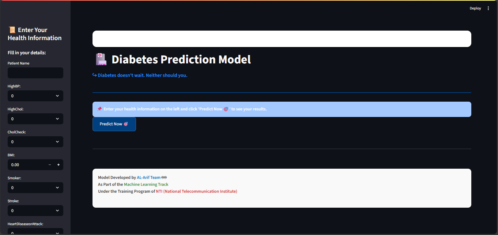

# Diabetes Prediction Assistant

An intelligent web app built with Streamlit that predicts diabetes status:  
Not Diabetic | Prediabetic | Diabetic

[Try the App Live](https://diabetespredictionproject-kk8nwcgdr5dr4sxr4n2bmt.streamlit.app)

---

## 📸 Screenshots



---

## Tech Stack

- Python
- Streamlit
- scikit-learn
- SMOTE (imbalanced-learn)
- FPDF (for PDF report generation)
- pandas, seaborn, matplotlib

---

## How to Run Locally

```bash
git clone https://github.com/MohamedHamed5/diabetes_prediction_project.git
cd diabetes_prediction_project
pip install -r requirements.txt
streamlit run code/app.py
```
---

## Disclaimer

This is a machine learning-based tool built for educational purposes only.  
It is **not a replacement for clinical diagnosis**. Please consult a healthcare professional for medical advice.

---

## Project Information

This project was built as part of the **NTI Machine Learning Track**  
Supervised by: **Ahmed Mohamed** & **Mahmoud Hefny**

### Team Members:
- Mohamed Hamed  
- Ahmed Elawady 
- Mariam Mohey  
- Felopater Magdy  
- Momen Elenany  
- Mohamed Mostafa

